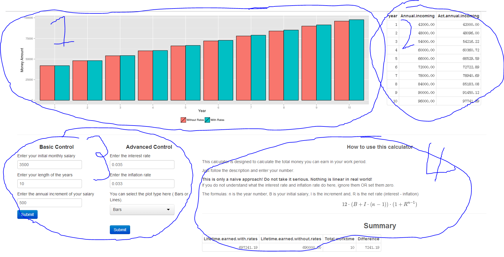

App Tutorial
========================================================
author: Bruce (Cheng) Chen
date: 2014/7/25


## __In this tutorial, I will show you:__
* how to use my app 
* the ideas behind it (naive ones and deep ones)

Layouts
========================================================


1. The bar/lines plot
2. THe annual detail table
3. The control panels
4. The brief instructions and summary table


How to use
========================================================
* This calculator is designed to calculate the total money you can earn in your work period based on the information you provide.
* Remember: this is just for fun, as you can see the formula I used is naive!
* The formula: __n__ is the year number, __B__ is your initial salary, __I__ is the increment and, __R__ is the net rate (interest - inflation)
$$
12 \times (B+I \times (n-1)) \times (1+R^{n-1})
$$

The key function and the only function...
========================================================
__I have hidden the function code, but you can check it in the source code.__


```r
cal(len = 5) # let's have a run.
```

```
[[1]]
  year salary annual.incoming  act.amt
1    1   3500           42000 42000.00
2    2   4000           48000 50880.00
3    3   4500           54000 60674.40
4    4   5000           60000 71460.96
5    5   5500           66000 83323.48

[[2]]
  no.infloation infloation
1        270000   308338.8
```

Food for thought
========================================================
#### Even though this model is extremely simple but it indeed has something useful:

* It shows the power of compound interest.
* You can use this app to help make your retirement plan:
   + Try out different combinantions of investment and ROI(again, ROI = interest - inflation) 
   + Have the clean and coloful plan visualizations
* Lines and bars are always much stronger and enjoyable than pure numbers

_Thank you!_
